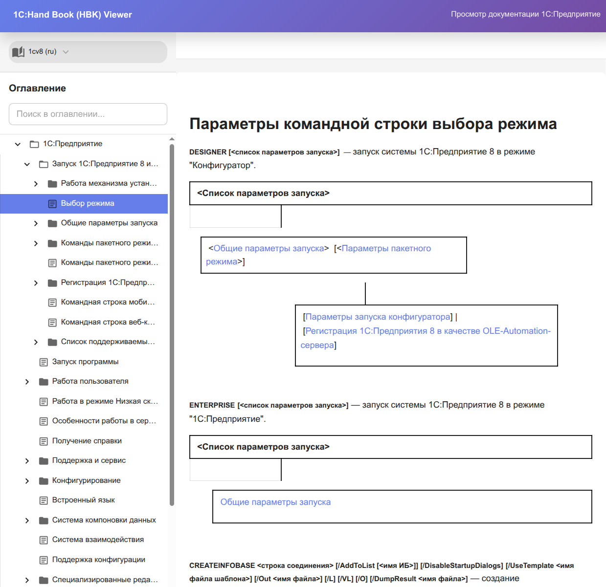
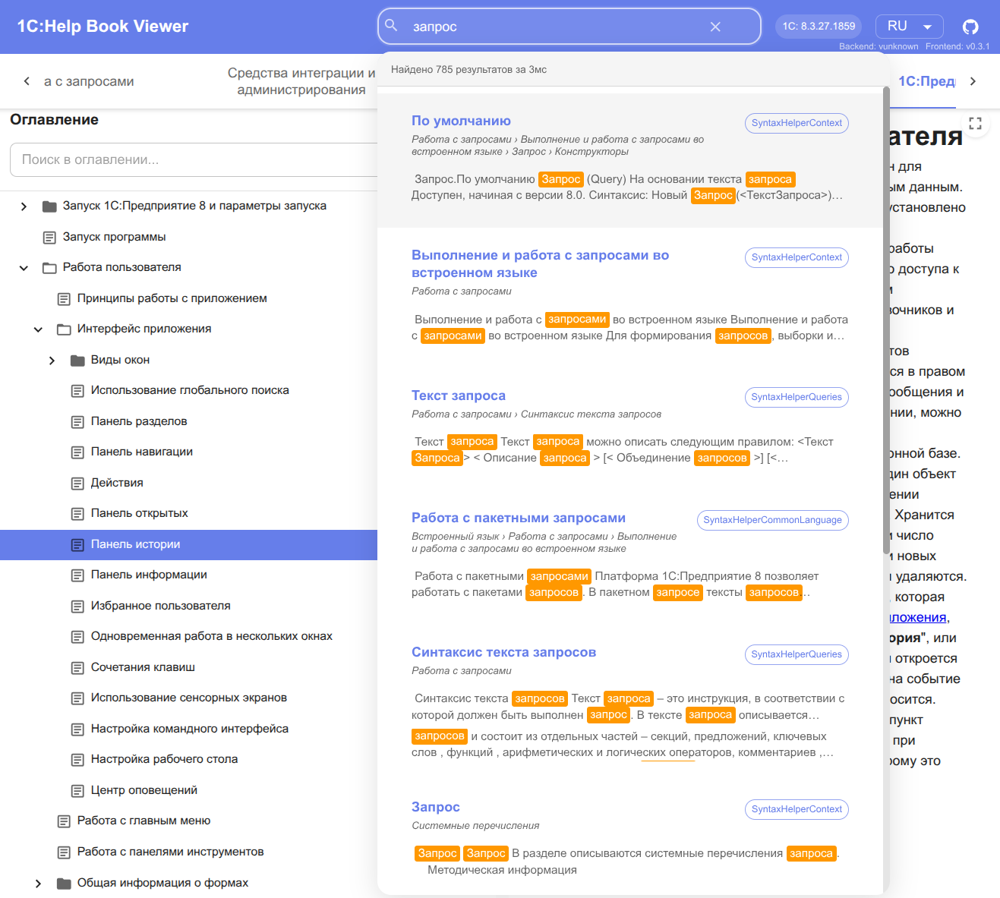
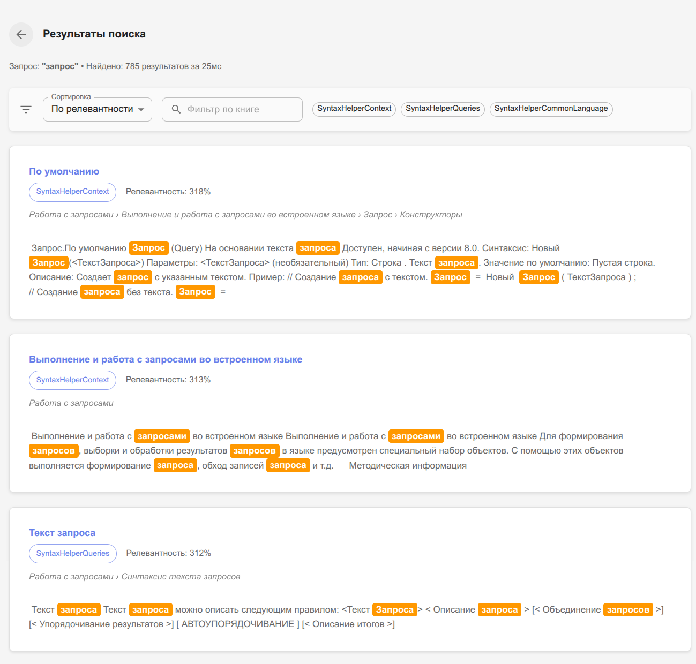
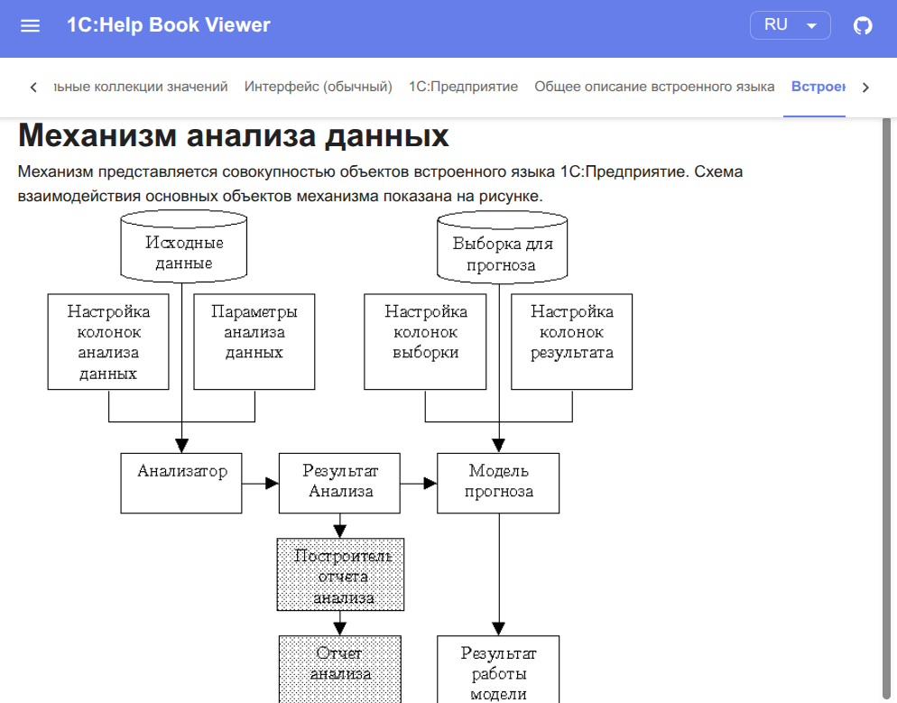
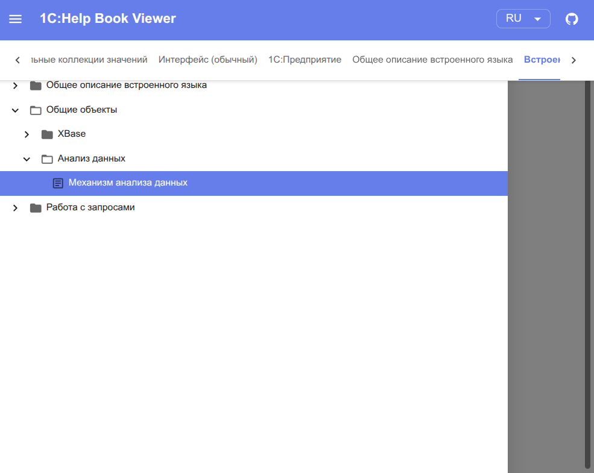

# 1C:Help Book (HBK) Viewer

**1C:Help Book (HBK) Viewer** — это инструмент для просмотра документации 1С:Предприятие из HBK (Help Book) файлов. Приложение предоставляет удобный веб-интерфейс для чтения страниц документации и навигации по оглавлению.



*Главное окно приложения с навигацией по разделам и содержимым страницы*

## Обзор

Приложение предназначено для просмотра документации платформы 1С:Предприятие из HBK файлов через современный веб-интерфейс. При запуске приложение автоматически сканирует указанный каталог установки 1С:Предприятие и загружает все доступные HBK файлы документации.

Подробное описание формата HBK файлов и их структуры доступно в [документации по формату HBK](doc/hbk-format.md).

### Возможности

- **Глобальное оглавление** — просмотр всех разделов документации в едином интерфейсе
- **Полнотекстовый поиск** — глобальный поиск по всему содержимому документации с использованием Apache Lucene
- **Навигация по вкладкам** — быстрое переключение между разделами документации
- **Иерархическое дерево** — удобная навигация по структуре документации с автоматическим раскрытием пути к текущей странице
- **Поиск по страницам** — быстрый поиск нужной информации
- **Адаптивный интерфейс** — полная поддержка мобильных устройств с сенсорным управлением
- **Отображение изображений** — корректная загрузка и отображение всех изображений из документации
- **Поддержка v8help ссылок** — автоматическая обработка внутренних ссылок документации
- **История браузера** — осмысленные названия страниц в истории для удобной навигации
- **Экспорт документации** — возможность экспорта HBK файлов в файловую систему или формат MkDocs
- **Запуск в Docker** — [подробная информация о запуске приложения в Docker контейнере](doc/docker.md)

### Глобальный полнотекстовый поиск
Приложение включает мощную систему полнотекстового поиска, которая индексирует все содержимое HBK файлов и позволяет быстро находить нужную информацию:

- **Автоматическая индексация** — все HBK файлы автоматически индексируются при запуске
- **Быстрый поиск** — результаты поиска отображаются в реальном времени
- **Подсветка результатов** — найденные фрагменты выделяются в тексте
- **Детальные результаты** — отдельная страница с полной информацией о найденных документах

*Строка поиска*


*Все результаты поиска*

### Мобильная версия

Приложение полностью адаптировано для мобильных устройств:

<table>
<tr>
<td width="50%">

<p align="center"><i>Просмотр содержимого на мобильном устройстве</i></p>
</td>
<td width="50%">

<p align="center"><i>Навигация по оглавлению с поддержкой свайп-жестов</i></p>
</td>
</tr>
</table>

Проект использует Spring Boot на базе Kotlin для бэкенда и React + TypeScript для фронтенда.

## История изменений

Все изменения проекта документированы в [CHANGELOG.md](doc/CHANGELOG.md).

## Требования

### Системные требования

- **Java**: версия 17 или выше

## Сборка

Проект собирается с помощью Gradle. Для сборки выполните следующую команду в корневой директории проекта:

```bash
./gradlew build
```

После успешной сборки исполняемый JAR-файл будет находиться в директории `build/libs/`.

## Использование

### Быстрый старт с Docker

Самый простой способ запустить приложение — использовать готовый Docker образ:

```bash
docker pull ghcr.io/alkoleft/hbk-viewer:latest

docker run -d \
  -p 8080:8080 \
  -v /opt/1cv8/x86_64/8.3.25.1257:/data/hbk:ro \
  ghcr.io/alkoleft/hbk-viewer:latest
```

После запуска откройте браузер и перейдите по адресу `http://localhost:8080`

Подробная информация о запуске в Docker доступна в [документации](doc/docker.md).

### Запуск из JAR файла

Приложение поддерживает два режима работы через CLI команды:
- **server** — запуск веб-сервера для просмотра документации
- **export** — экспорт HBK файлов в файловую систему

### Команда server

Запускает web сервер приложения.

**Синтаксис:**

```bash
java -jar hbk-reader-<версия>.jar server [опции]
```

**Опции:**

- `--path`, `-p` - директория с HBK файлами (обязательно)
- `--verbose`, `-v` - включить отладочное логирование

**Примеры:**

```bash
# Основной способ запуска
java -jar hbk-reader-0.4.0.jar server --path "/opt/1cv8/x86_64/8.3.25.1257"

# Сокращенная форма
java -jar hbk-reader-0.4.0.jar server -p "/opt/1cv8/x86_64/8.3.25.1257"

# С отладочным логированием
java -jar hbk-reader-0.4.0.jar server -p "/opt/1cv8/x86_64/8.3.25.1257" --verbose
```

После запуска откройте браузер и перейдите по адресу `http://localhost:8080`

### Команда export

Экспортирует HBK файл в указанную директорию.

**Синтаксис:**

```bash
java -jar hbk-reader-<версия>.jar export --file <путь-к-hbk> --output <директория> [опции]
```

**Опции:**

- `--file`, `-f` - путь к HBK файлу для экспорта (обязательно)
- `--output`, `-o` - директория для сохранения распакованных файлов (обязательно)
- `--pages-only`, `-p` - экспортировать только HTML страницы (по умолчанию: false)
- `--include-toc`, `-t` - включить оглавление в экспорт, только для полного экспорта (по умолчанию: true)
- `--preserve-structure`, `-s` - сохранить структуру каталогов, только для pages-only (по умолчанию: true)

**Примеры:**

```bash
# Полный экспорт HBK файла
java -jar hbk-reader-0.4.0.jar export \
  --file "/path/to/platform.hbk" \
  --output "/path/to/output"

# Экспорт только HTML страниц
java -jar hbk-reader-0.4.0.jar export \
  --file "/path/to/platform.hbk" \
  --output "/path/to/output" \
  --pages-only

# Экспорт страниц без сохранения структуры каталогов
java -jar hbk-reader-0.4.0.jar export \
  --file "/path/to/platform.hbk" \
  --output "/path/to/output" \
  --pages-only \
  --preserve-structure false

# Полный экспорт без оглавления
java -jar hbk-reader-0.4.0.jar export \
  --file "/path/to/platform.hbk" \
  --output "/path/to/output" \
  --include-toc false
```

Для получения справки по конкретной команде используйте:

```bash
java -jar hbk-reader-0.4.0.jar <команда> --help
```

## Веб-приложение

Проект включает веб-интерфейс для удобного просмотра содержимого HBK файлов.

### Запуск веб-приложения для разработки

1. Перейдите в директорию `web/`:

   ```bash
   cd web
   ```

2. Установите зависимости:

   ```bash
   npm install
   ```

3. Запустите dev-сервер:

   ```bash
   npm run dev
   ```

Веб-приложение будет доступно по адресу `http://localhost:3000`

**Важно:** Убедитесь, что бэкенд приложение (Spring Boot) запущено на порту 8080.

### Сборка веб-приложения

```bash
cd web
npm run build
```

Собранные файлы будут в директории `web/dist/`.

Подробную информацию о веб-приложении смотрите в [web/README.md](web/README.md).

## Зависимости

Основные зависимости проекта:

- Spring Boot 3.5.0
- Kotlin с Coroutines
- Jackson (для работы с JSON)
- Apache Commons Compress (для работы с архивами)
- Logback для логирования

## Лицензия

Этот проект распространяется под лицензией MIT. Подробную информацию смотрите в файле [LICENSE](LICENSE).
