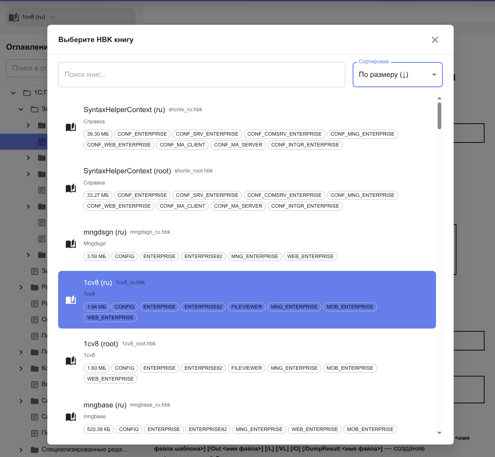

# 1C:Hand Book (HBK) Viewer

**1C:Hand Book (HBK) Viewer** — это инструмент для просмотра документации 1С:Предприятие из HBK (Help Book) файлов. Приложение предоставляет удобный веб-интерфейс для чтения страниц документации и навигации по оглавлению.


## Обзор

Приложение предназначено для просмотра документации платформы 1С:Предприятие из HBK файлов, позволяя читать страницы документации по имени и получать структуру оглавления через современный веб-интерфейс.

В одном окне приложения можно просматривать все доступные книги документации 1С:Предприятие. Вы можете легко переключаться между различными HBK файлами и получать быстрый доступ к любой нужной документации без необходимости открывать отдельные приложения или файлы.



*Диалог выбора HBK файла. В одном окне можно просматривать любые доступные книги документации.*

### Возможности

- **Чтение страниц по имени** — получение HTML содержимого страниц документации из HBK файла
- **Чтение оглавления** — получение структуры оглавления (TOC) с иерархией страниц
- **Поиск страниц** — поиск страниц по русскому или английскому названию
- **Веб-интерфейс** — современное веб-приложение на TypeScript/React для просмотра документации

Проект использует Spring Boot на базе Kotlin для бэкенда и React + TypeScript для фронтенда.

## Требования

### Системные требования
- **Java**: версия 17 или выше
- **Операционная система**: Linux, macOS, Windows
- **Память**: минимум 512 МБ RAM для работы приложения
- **Место на диске**: 100 МБ для установки приложения

### Для работы с HBK файлами
- **Платформа 1С Предприятие**: версия 8.3.20 или выше (рекомендуется)
- **HBK файл**: файл справки платформы (обычно `shcntx_ru.hbk`)

### Зависимости времени выполнения
Все необходимые зависимости включены в исполняемый JAR-файл:
- Spring Boot 3.5.0
- Jackson 2.15.2
- Kotlin Coroutines
- Apache Commons Compress

## Сборка

Проект собирается с помощью Gradle. Для сборки выполните следующую команду в корневой директории проекта:

```bash
./gradlew build
```

После успешной сборки исполняемый JAR-файл будет находиться в директории `build/libs/`.

## Использование

### Запуск приложения

```bash
java -jar hbk-reader-<версия>.jar [опции]
```

**Опции:**

- `--platform-path`, `-p` - путь к каталогу установки 1С Предприятия (для автоматического поиска HBK файла)
- `--help`, `-h` - показать справку по использованию
- `--verbose` - включить отладочное логирование

**Примеры:**

```bash
# Основной способ запуска
java -jar hbk-reader-0.2.0.jar --platform-path "/opt/1cv8/x86_64/8.3.25.1257"

# Сокращенная форма
java -jar hbk-reader-0.2.0.jar -p "/opt/1cv8/x86_64/8.3.25.1257"

# Показать справку
java -jar hbk-reader-0.2.0.jar --help
```

### Возможности

#### Чтение страниц

Приложение позволяет читать страницы из HBK файла по имени. Поддерживается поиск как по русскому, так и по английскому названию страницы.

#### Чтение оглавления

Приложение может извлечь и предоставить структуру оглавления (TOC) из HBK файла с полной иерархией страниц.

## Веб-приложение

Проект включает веб-интерфейс для удобного просмотра содержимого HBK файлов.

### Запуск веб-приложения

1. Перейдите в директорию `web/`:
```bash
cd web
```

2. Установите зависимости:
```bash
npm install
```

3. Запустите dev-сервер:
```bash
npm run dev
```

Веб-приложение будет доступно по адресу `http://localhost:3000`

**Важно:** Убедитесь, что бэкенд приложение (Spring Boot) запущено на порту 8080.

### Сборка веб-приложения

```bash
cd web
npm run build
```

Собранные файлы будут в директории `web/dist/`.

Подробную информацию о веб-приложении смотрите в [web/README.md](web/README.md).

## Зависимости

Основные зависимости проекта:

- Spring Boot 3.5.0
- Kotlin с Coroutines
- Jackson (для работы с JSON)
- Apache Commons Compress (для работы с архивами)
- Logback для логирования

## Лицензия

Этот проект распространяется под лицензией MIT. Подробную информацию смотрите в файле [LICENSE](LICENSE).
