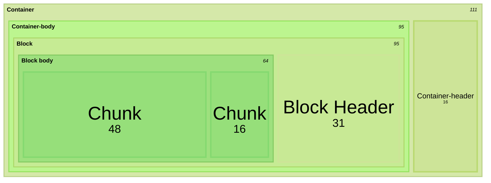
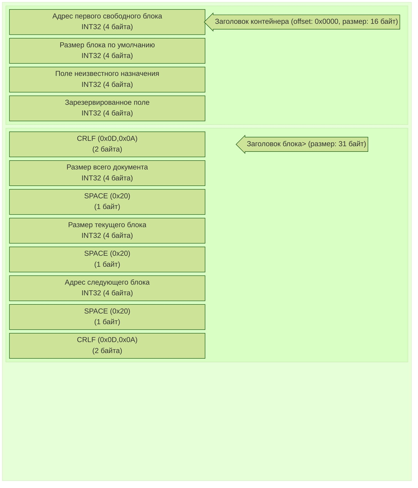
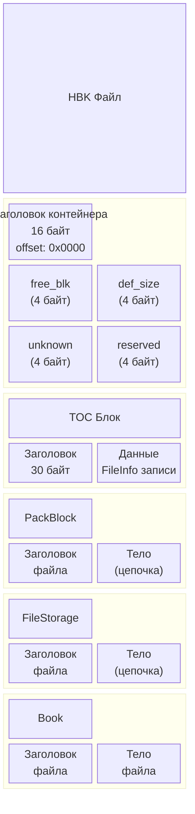
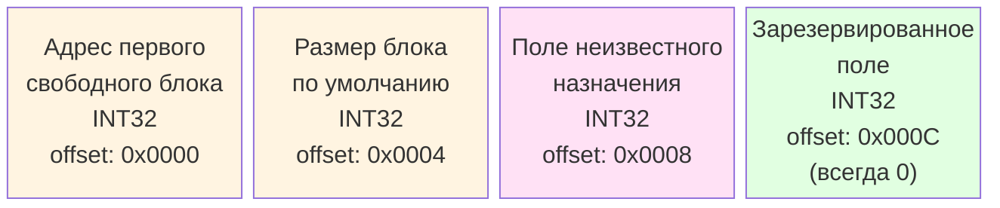
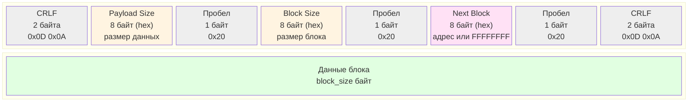
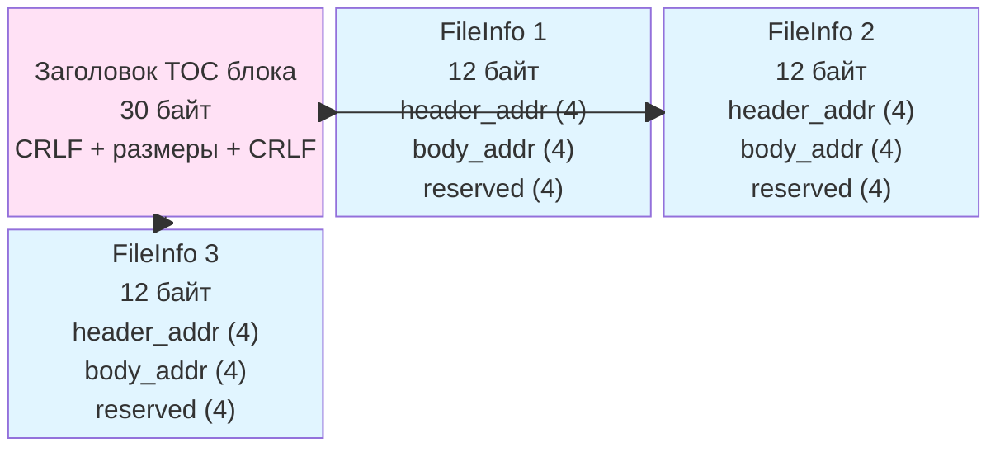
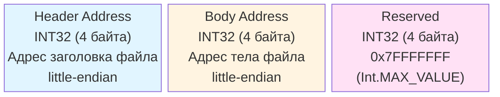
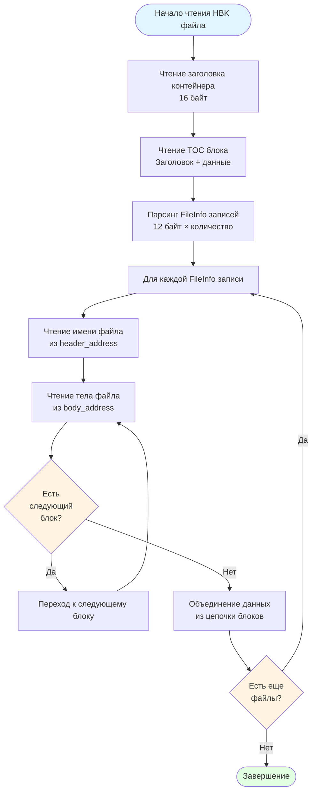

# Бинарный формат файлов HBK

## Обзор

Этот документ описывает низкоуровневую бинарную структуру HBK (Help Book) файлов платформы 1С:Предприятие. Для общего описания формата и содержимого HBK файлов см. [Формат файлов HBK](hbk-format.md).

## Структура контейнера

Источник [Описание формата файлов конфигурации (CF, EPF, ERF)](https://infostart.ru/1c/articles/250142/)



### Макет структуры HBK файла



### Заголовок контейнера, 16 байт


| Поле                           | Тип             | Описание                                                                                                                                                                                                                                                    |
|--------------------------------|-----------------|-------------------------------------------------------------------------------------------------------------------------------------------------------------------------------------------------------------------------------------------------------------|
| Адрес первого свободного блока | INT32 (4 байта) | Смещение, по которому начинается цепочка свободных блоков                                                                                                                                                                                                   |
| Размер блока по умолчанию      | INT32 (4 байта) | Блок может иметь произвольную длину, но значение по умолчанию можно использовать для добавления новых блоков, например.                                                                                                                                     |
| Поле неизвестного назначения   | INT32 (4 байта) | Число, отражающее некоторую величину, как правило, совпадающую с количеством файлов в контейнере, однако, коллеги в комментариях считают, что это не совсем так. На алгоритм интерпретации контейнера данное число никак не влияет, его можно игнорировать. |
| Зарезервированное поле         | INT32 (4 байта) | Всегда равно 0 (всегда ли?)                                                                                                                                                                                                                                 |

### Заголовок блока, 31 байт

  ```mermaid
  ---
  config:
      theme: 'forest'
  ---
  block
    CRLF1["CRLF (0x0D,0x0A)\n(2 байта)"]
    payloadSize["Размер всего документа\nINT32 (4 байта)"]
    space1["SPACE (0x20)\n(1 байт)"]
    blockSize["Размер текущего блока\nINT32 (4 байта)"]
    space1["SPACE (0x20)\n(1 байт)"]
    nextBlock["Адрес следующего блока\nINT32 (4 байта)"]
    space1["SPACE (0x20)\n(1 байт)"]
    CRLF2["CRLF (0x0D,0x0A)\n(2 байта)"]
  ```

  | Поле                           | Тип             | Описание                                                                                                                                                                                                                                                    |
  |--------------------------------|-----------------|-------------------------------------------------------------------------------------------------------------------------------------------------------------------------------------------------------------------------------------------------------------|
  | Адрес первого свободного блока | INT32 (4 байта) | Смещение, по которому начинается цепочка свободных блоков                                                                                                                                                                                                   |
  | Размер блока по умолчанию      | INT32 (4 байта) | Блок может иметь произвольную длину, но значение по умолчанию можно использовать для добавления новых блоков, например.                                                                                                                                     |
  | Поле неизвестного назначения   | INT32 (4 байта) | Число, отражающее некоторую величину, как правило, совпадающую с количеством файлов в контейнере, однако, коллеги в комментариях считают, что это не совсем так. На алгоритм интерпретации контейнера данное число никак не влияет, его можно игнорировать. |
  | Зарезервированное поле         | INT32 (4 байта) | Всегда равно 0 (всегда ли?)                                                                                                                                                                                                                                 |

```plain
┌─────────────────────────────────────────────────────────────────────┐
│ HBK ФАЙЛ                                                             │
├─────────────────────────────────────────────────────────────────────┤
│                                                                     │
│ ┌───────────────────────────────────────────────────────────────┐ │
│ │ ЗАГОЛОВОК КОНТЕЙНЕРА (offset: 0x0000, размер: 16 байт)        │ │
│ │ ┌──────────┬──────────┬──────────┬──────────┐                │ │
│ │ │ free_blk │ def_size │ unknown  │ reserved │                │ │
│ │ │ (4 байт) │ (4 байт)  │ (4 байт) │ (4 байт) │                │ │
│ │ └──────────┴──────────┴──────────┴──────────┘                │ │
│ └───────────────────────────────────────────────────────────────┘ │
│                                                                     │
│ ┌───────────────────────────────────────────────────────────────┐ │
│ │ TOC БЛОК (offset: 0x0010)                                     │ │
│ │ ┌───────────────────────────────────────────────────────────┐ │ │
│ │ │ Заголовок блока (30 байт)                                  │ │ │
│ │ └───────────────────────────────────────────────────────────┘ │ │
│ │ ┌───────────────────────────────────────────────────────────┐ │ │
│ │ │ FileInfo записи (12 байт × N)                             │ │ │
│ │ │ ┌──────────┬──────────┬──────────┐                        │ │ │
│ │ │ │ header   │ body    │ reserved │                        │ │ │
│ │ │ │ addr     │ addr    │          │                        │ │ │
│ │ │ └──────────┴──────────┴──────────┘                        │ │ │
│ │ │ ... (повторяется для каждого файла)                       │ │ │
│ │ └───────────────────────────────────────────────────────────┘ │ │
│ └───────────────────────────────────────────────────────────────┘ │
│                                                                     │
│ ┌───────────────────────────────────────────────────────────────┐ │
│ │ БЛОКИ ФАЙЛОВ (размещены по адресам из FileInfo)               │ │
│ │                                                                 │ │
│ │ ┌───────────────────────────────────────────────────────────┐ │ │
│ │ │ Блок заголовка файла "PackBlock"                          │ │ │
│ │ │ (по адресу из FileInfo[0].header_address)                 │ │ │
│ │ └───────────────────────────────────────────────────────────┘ │ │
│ │ ┌───────────────────────────────────────────────────────────┐ │ │
│ │ │ Блок тела файла "PackBlock"                               │ │ │
│ │ │ (по адресу из FileInfo[0].body_address)                  │ │ │
│ │ │ ┌──────┬──────┬──────┐                                    │ │ │
│ │ │ │ Блок │ Блок │ Блок │  ← Цепочка блоков                 │ │ │
│ │ │ │  1   │  2   │  3   │                                    │ │ │
│ │ │ └──────┴──────┴──────┘                                    │ │ │
│ │ └───────────────────────────────────────────────────────────┘ │ │
│ │                                                                 │ │
│ │ ┌───────────────────────────────────────────────────────────┐ │ │
│ │ │ Блок заголовка файла "FileStorage"                        │ │ │
│ │ │ (по адресу из FileInfo[1].header_address)                 │ │ │
│ │ └───────────────────────────────────────────────────────────┘ │ │
│ │ ┌───────────────────────────────────────────────────────────┐ │ │
│ │ │ Блок тела файла "FileStorage"                            │ │ │
│ │ │ (по адресу из FileInfo[1].body_address)                  │ │ │
│ │ │ ┌──────┬──────┐                                           │ │ │
│ │ │ │ Блок │ Блок │  ← Цепочка блоков                        │ │ │
│ │ │ │  1   │  2   │                                           │ │ │
│ │ │ └──────┴──────┘                                           │ │ │
│ │ └───────────────────────────────────────────────────────────┘ │ │
│ │                                                                 │ │
│ │ ... (аналогично для остальных файлов)                          │ │
│ └───────────────────────────────────────────────────────────────┘ │
│                                                                     │
└─────────────────────────────────────────────────────────────────────┘
```

## Структура HBK контейнера

HBK файл представляет собой бинарный контейнер с определенной структурой заголовков и блоков данных. Контейнер хранит набор **сущностей** (entities), каждая из которых имеет:

- **Имя** — строка в кодировке UTF-16LE
- **Данные** — бинарные данные, организованные в блоки

### Порядок байтов

Все числовые значения в HBK файле хранятся в формате **little-endian**.

### Общая структура файла



## Заголовок контейнера

Заголовок контейнера занимает первые 16 байт файла и содержит следующие поля (по 4 байта каждое, INT32):

### Структура заголовка контейнера



1. **Адрес первого свободного блока** (INT32)
   - Смещение, по которому начинается цепочка свободных блоков
   - Используется для управления свободным пространством в контейнере

2. **Размер блока по умолчанию** (INT32)
   - Блок может иметь произвольную длину, но значение по умолчанию можно использовать для добавления новых блоков

3. **Поле неизвестного назначения** (INT32)
   - Число, отражающее некоторую величину, как правило, совпадающее с количеством файлов в контейнере
   - На алгоритм интерпретации контейнера данное число никак не влияет, его можно игнорировать

4. **Зарезервированное поле** (INT32)
   - Всегда равно 0

### Визуализация заголовка контейнера

```
Смещение  │ Размер │ Поле                          │ Пример значения (hex)
──────────┼────────┼───────────────────────────────┼──────────────────────
0x0000    │   4    │ Адрес первого свободного      │ 00 00 00 00
          │        │ блока (INT32, little-endian)  │
──────────┼────────┼───────────────────────────────┼──────────────────────
0x0004    │   4    │ Размер блока по умолчанию     │ 00 01 00 00 (256)
          │        │ (INT32, little-endian)        │
──────────┼────────┼───────────────────────────────┼──────────────────────
0x0008    │   4    │ Поле неизвестного назначения  │ 03 00 00 00 (3)
          │        │ (INT32, little-endian)        │
──────────┼────────┼───────────────────────────────┼──────────────────────
0x000C    │   4    │ Зарезервированное поле        │ 00 00 00 00 (0)
          │        │ (INT32, little-endian)        │
──────────┴────────┴───────────────────────────────┴──────────────────────
          │  16 байт всего
```

**Представление в памяти (little-endian):**
```
Адрес:  0x0000  0x0001  0x0002  0x0003
        ┌───────┬───────┬───────┬───────┐
        │ 0x00  │ 0x00  │ 0x00  │ 0x00  │  ← Адрес первого свободного блока
        └───────┴───────┴───────┴───────┘
Адрес:  0x0004  0x0005  0x0006  0x0007
        ┌───────┬───────┬───────┬───────┐
        │ 0x00  │ 0x01  │ 0x00  │ 0x00  │  ← Размер блока по умолчанию (256)
        └───────┴───────┴───────┴───────┘
Адрес:  0x0008  0x0009  0x000A  0x000B
        ┌───────┬───────┬───────┬───────┐
        │ 0x03  │ 0x00  │ 0x00  │ 0x00  │  ← Поле неизвестного назначения (3)
        └───────┴───────┴───────┴───────┘
Адрес:  0x000C  0x000D  0x000E  0x000F
        ┌───────┬───────┬───────┬───────┐
        │ 0x00  │ 0x00  │ 0x00  │ 0x00  │  ← Зарезервированное поле (0)
        └───────┴───────┴───────┴───────┘
```

## Блок оглавления контейнера (TOC блок)

После заголовка контейнера следует блок оглавления, который содержит список всех сущностей в контейнере.

### Заголовок блока

Каждый блок данных в HBK контейнере имеет заголовок следующего формата:

### Структура заголовка блока



```
[CRLF]                    (2 байта) - Разделитель
[payload_size_hex]        (8 байт) - Размер полезной нагрузки в hex формате
[пробел]                  (1 байт)
[block_size_hex]          (8 байт) - Размер блока в hex формате
[пробел]                  (1 байт)
[next_block_hex]          (8 байт) - Адрес следующего блока в hex формате (или FFFFFFFF если последний)
[пробел]                  (1 байт)
[CRLF]                    (2 байта) - Разделитель
[данные блока]            (block_size байт)
```

### Визуализация структуры блока

```
┌─────────────────────────────────────────────────────────────────┐
│ ЗАГОЛОВОК БЛОКА (30 байт)                                       │
├─────────────────────────────────────────────────────────────────┤
│ Смещение │ Размер │ Поле               │ Пример                 │
├──────────┼────────┼────────────────────┼────────────────────────┤
│ +0       │   2    │ CRLF               │ 0D 0A                  │
│ +2       │   8    │ Payload Size (hex) │ "00000100" (256)       │
│ +10      │   1    │ Пробел             │ 0x20                   │
│ +11      │   8    │ Block Size (hex)   │ "00000100" (256)       │
│ +19      │   1    │ Пробел             │ 0x20                   │
│ +20      │   8    │ Next Block (hex)   │ "FFFFFFFF" (конец)     │
│ +28      │   1    │ Пробел             │ 0x20                   │
│ +29      │   2    │ CRLF               │ 0D 0A                  │
└─────────────────────────────────────────────────────────────────┘
┌─────────────────────────────────────────────────────────────────┐
│ ДАННЫЕ БЛОКА (block_size байт)                                  │
├─────────────────────────────────────────────────────────────────┤
│ [Бинарные данные блока]                                         │
└─────────────────────────────────────────────────────────────────┘
```

**Представление в памяти:**
```
Адрес:  +0    +1    +2    +3    +4    +5    +6    +7    +8    +9
        ┌─────┬─────┬─────┬─────┬─────┬─────┬─────┬─────┬─────┬─────┐
        │ 0D  │ 0A  │ '0' │ '0' │ '0' │ '0' │ '0' │ '1' │ '0' │ '0' │
        └─────┴─────┴─────┴─────┴─────┴─────┴─────┴─────┴─────┴─────┘
        CRLF        Payload Size (hex строка "00000100")
        
Адрес:  +10   +11   +12   +13   +14   +15   +16   +17   +18   +19
        ┌─────┬─────┬─────┬─────┬─────┬─────┬─────┬─────┬─────┬─────┐
        │ ' ' │ '0' │ '0' │ '0' │ '0' │ '0' │ '0' │ '1' │ '0' │ '0' │
        └─────┴─────┴─────┴─────┴─────┴─────┴─────┴─────┴─────┴─────┘
        Пробел      Block Size (hex строка "00000100")
        
Адрес:  +20   +21   +22   +23   +24   +25   +26   +27   +28   +29
        ┌─────┬─────┬─────┬─────┬─────┬─────┬─────┬─────┬─────┬─────┐
        │ 'F' │ 'F' │ 'F' │ 'F' │ 'F' │ 'F' │ 'F' │ 'F' │ ' ' │ 0D  │
        └─────┴─────┴─────┴─────┴─────┴─────┴─────┴─────┴─────┴─────┘
        Next Block (hex строка "FFFFFFFF")  Пробел  CRLF
        
Адрес:  +30   +31   ...   +285
        ┌─────┬─────┬─────┬─────┐
        │     Данные блока      │
        │   (256 байт)          │
        └─────┴─────┴─────┴─────┘
```

Блоки могут быть связаны в цепочку через указатель на следующий блок. Если `next_block_hex` равен `FFFFFFFF` (или `Int.MAX_VALUE`), это последний блок в цепочке.

### Структура TOC блока

TOC блок содержит список файловых записей (FileInfo). Каждая запись занимает 12 байт (3 × INT32):

### Визуализация структуры TOC блока



```
[header_address]    (INT32, 4 байта) - Адрес заголовка файла
[body_address]      (INT32, 4 байта) - Адрес тела файла
[reserved]          (INT32, 4 байта) - Зарезервированное поле (должно быть Int.MAX_VALUE)
```

Количество записей определяется как `размер_данных_TOC_блока / 12`.

### Визуализация TOC блока

```
┌─────────────────────────────────────────────────────────────────┐
│ TOC БЛОК - Заголовок блока (30 байт)                           │
├─────────────────────────────────────────────────────────────────┤
│ [CRLF] [payload_size] [ ] [block_size] [ ] [next_block] [ ] [CRLF] │
└─────────────────────────────────────────────────────────────────┘
┌─────────────────────────────────────────────────────────────────┐
│ TOC БЛОК - Данные (список FileInfo записей)                    │
├─────────────────────────────────────────────────────────────────┤
│ FileInfo 1 (12 байт):                                          │
│   ┌──────────┬──────────┬──────────┐                           │
│   │ header   │ body    │ reserved │                           │
│   │ address  │ address │ (0x7F...)│                           │
│   │ (4 байта)│ (4 байта)│ (4 байта)│                           │
│   └──────────┴──────────┴──────────┘                           │
├─────────────────────────────────────────────────────────────────┤
│ FileInfo 2 (12 байт):                                          │
│   ┌──────────┬──────────┬──────────┐                           │
│   │ header   │ body    │ reserved │                           │
│   │ address  │ address │ (0x7F...)│                           │
│   │ (4 байта)│ (4 байта)│ (4 байта)│                           │
│   └──────────┴──────────┴──────────┘                           │
├─────────────────────────────────────────────────────────────────┤
│ FileInfo 3 (12 байт):                                           │
│   ┌──────────┬──────────┬──────────┐                           │
│   │ header   │ body    │ reserved │                           │
│   │ address  │ address │ (0x7F...)│                           │
│   │ (4 байта)│ (4 байта)│ (4 байта)│                           │
│   └──────────┴──────────┴──────────┘                           │
└─────────────────────────────────────────────────────────────────┘
```

### Структура FileInfo записи



**Пример FileInfo записи (little-endian):**
```
Адрес:  +0    +1    +2    +3    +4    +5    +6    +7    +8    +9    +10   +11
        ┌─────┬─────┬─────┬─────┬─────┬─────┬─────┬─────┬─────┬─────┬─────┬─────┐
        │ 40  │ 00  │ 00  │ 00  │ 80  │ 00  │ 00  │ 00  │ FF  │ FF  │ FF  │ 7F  │
        └─────┴─────┴─────┴─────┴─────┴─────┴─────┴─────┴─────┴─────┴─────┴─────┘
        header_address=0x00000040  body_address=0x00000080  reserved=0x7FFFFFFF
        (64)                       (128)                    (Int.MAX_VALUE)
```

## Извлечение сущностей

### Чтение имени файла

Для каждой записи в TOC блоке имя файла читается из заголовка файла по адресу `header_address`:

1. Пропустить CRLF (2 байта)
2. Прочитать размер полезной нагрузки (payload size) — 8 байт в hex формате
3. Пропустить пробел (1 байт)
4. Пропустить остальные поля заголовка (40 байт):
   - block_size (8 байт hex + 1 байт пробел)
   - next_block (8 байт hex + 1 байт пробел)
   - CRLF (2 байта)
   - Дополнительные поля (8 + 8 + 4 = 20 байт)
5. Прочитать имя файла: `(payload_size - 24)` байт в кодировке UTF-16LE

### Чтение тела файла

Тело файла читается по адресу `body_address`:

1. Прочитать заголовок блока (см. формат выше)
2. Прочитать данные блока, учитывая цепочку блоков:
   - Если есть следующий блок (`next_block != FFFFFFFF`), перейти к нему
   - Повторять до конца цепочки
3. Объединить все данные из цепочки блоков

## Процесс чтения HBK файла

Полный процесс чтения HBK файла включает следующие шаги:

### Диаграмма процесса чтения



### 1. Чтение заголовка контейнера

```kotlin
buffer.order(ByteOrder.LITTLE_ENDIAN)
val firstFreeBlock = buffer.int      // Адрес первого свободного блока
val defaultBlockSize = buffer.int    // Размер блока по умолчанию
val unknownField = buffer.int        // Поле неизвестного назначения
val reserved = buffer.int            // Зарезервированное поле (0)
```

### 2. Чтение блока оглавления контейнера (TOC блок)

```kotlin
// Пропустить CRLF
skipBlock(buffer, 2)

// Прочитать размеры блока
val payloadSize = getLongString(buffer)  // Размер полезной нагрузки
buffer.get()                              // Пробел
val blockSize = getLongString(buffer)     // Размер блока
buffer.get()                              // Пробел
val nextBlock = getLongString(buffer)     // Адрес следующего блока
skipBlock(buffer, 3)                      // Пробел + CRLF

// Прочитать данные TOC блока
val fileInfos = readBlock(buffer, Block(payloadSize, blockSize, nextBlock))
```

### 3. Парсинг списка файловых записей

```kotlin
val fileInfosBuffer = ByteBuffer.wrap(fileInfos).order(ByteOrder.LITTLE_ENDIAN)
val count = fileInfosBuffer.capacity() / 12  // 12 байт на запись

for (i in 1..count) {
    val headerAddress = fileInfosBuffer.int
    val bodyAddress = fileInfosBuffer.int
    val reserved = fileInfosBuffer.int
    
    if (reserved != Int.MAX_VALUE) {
        throw RuntimeException("Invalid file info entry")
    }
    
    val name = getHbkFileName(buffer, headerAddress)
    entities[name] = bodyAddress
}
```

### 4. Извлечение содержимого сущностей

Для каждой сущности тело файла извлекается по адресу из FileInfo:

```kotlin
fun getEntity(name: String): ByteArray? {
    val bodyAddress = entities[name] ?: return null
    return getHbkFileBody(buffer, bodyAddress)
}
```

## Формат блоков данных

### Структура заголовка блока (таблица)

| Поле | Размер | Описание |
|------|--------|-----------|
| CRLF | 2 байта | Разделитель начала блока |
| Payload Size | 8 байт (hex строка) | Размер полезной нагрузки в шестнадцатеричном формате |
| Пробел | 1 байт | Разделитель |
| Block Size | 8 байт (hex строка) | Размер текущего блока в шестнадцатеричном формате |
| Пробел | 1 байт | Разделитель |
| Next Block | 8 байт (hex строка) | Адрес следующего блока или FFFFFFFF |
| Пробел | 1 байт | Разделитель |
| CRLF | 2 байта | Разделитель конца заголовка |
| Данные | block_size байт | Полезная нагрузка блока |

### Цепочки блоков

Блоки могут быть связаны в цепочку для хранения данных, превышающих размер одного блока:

1. Первый блок содержит часть данных
2. Если данных больше, чем размер блока, в поле `next_block` указывается адрес следующего блока
3. Процесс повторяется до тех пор, пока все данные не будут сохранены
4. Последний блок имеет `next_block = FFFFFFFF`

### Визуализация цепочки блоков

```mermaid
block-beta
  columns 3
  
  Block1["Блок 1<br/>offset: 0x100<br/>Заголовок: 30 байт<br/>Данные: 256 байт"]
  Block2["Блок 2<br/>offset: 0x200<br/>Заголовок: 30 байт<br/>Данные: 256 байт"]
  Block3["Блок 3<br/>offset: 0x300<br/>Заголовок: 30 байт<br/>Данные: остаток<br/>next: 0xFFFFFFFF"]
  
  Block1 -->|"next_block<br/>0x00000200"| Block2
  Block2 -->|"next_block<br/>0x00000300"| Block3
  
  style Block1 fill:#e1f5ff
  style Block2 fill:#e1f5ff
  style Block3 fill:#ffe1f5
```

**Представление в памяти:**
```
Адрес:  0x100
        ┌─────────────────────────────────────┐
        │ Заголовок блока 1 (30 байт)         │
        │ next_block = 0x00000200             │
        ├─────────────────────────────────────┤
        │ Данные блока 1 (256 байт)           │
        └─────────────────────────────────────┘
                    │
                    │ next_block указывает на
                    ▼
Адрес:  0x200
        ┌─────────────────────────────────────┐
        │ Заголовок блока 2 (30 байт)         │
        │ next_block = 0x00000300             │
        ├─────────────────────────────────────┤
        │ Данные блока 2 (256 байт)           │
        └─────────────────────────────────────┘
                    │
                    │ next_block указывает на
                    ▼
Адрес:  0x300
        ┌─────────────────────────────────────┐
        │ Заголовок блока 3 (30 байт)         │
        │ next_block = 0xFFFFFFFF (конец)     │
        ├─────────────────────────────────────┤
        │ Данные блока 3 (остаток данных)     │
        └─────────────────────────────────────┘
```

### Пример чтения цепочки блоков

```kotlin
fun readBlock(buffer: ByteBuffer, block: Block): ByteArray {
    val data = ByteArray(block.payloadSize)
    var currentBlock = block
    var offset = 0
    
    do {
        val length = min(currentBlock.blockSize, block.payloadSize - offset)
        buffer.get(data, offset, length)
        offset += length
        
        if (currentBlock.hasNextBlock) {
            buffer.position(currentBlock.nextBlockPosition)
            currentBlock = readBlockHeader(buffer)
        } else {
            break
        }
    } while (true)
    
    return data
}
```

## Кодировки

Различные части HBK файла используют разные кодировки:

- **Имена сущностей:** UTF-16LE (16-битная кодировка, little-endian)
- **Заголовки блоков:** ASCII (для hex строк и разделителей)
- **Содержимое PackBlock:** UTF-8 (после распаковки из ZIP)
- **Содержимое Book:** UTF-8
- **HTML-файлы в FileStorage:** UTF-8 (или кодировка, указанная в HTML)

## Примеры

### Пример чтения заголовка контейнера

```kotlin
val buffer = FileChannel.map(FileChannel.MapMode.READ_ONLY, 0, fileSize)
buffer.order(ByteOrder.LITTLE_ENDIAN)

// Чтение заголовка (16 байт)
val firstFreeBlock = buffer.int      // 0x00000000
val defaultBlockSize = buffer.int    // 0x00000100 (256)
val unknownField = buffer.int        // 0x00000003 (3 файла)
val reserved = buffer.int            // 0x00000000
```

### Пример чтения блока

```kotlin
// Пропустить CRLF
buffer.position(buffer.position() + 2)

// Прочитать размеры (как hex строки)
val payloadSizeHex = ByteArray(8)
buffer.get(payloadSizeHex)
val payloadSize = String(payloadSizeHex).toLong(16).toInt()

// Пропустить пробел
buffer.get()

// Аналогично для blockSize и nextBlock
```

## См. также

- [Формат файлов HBK](hbk-format.md) — общее описание формата и содержимого
